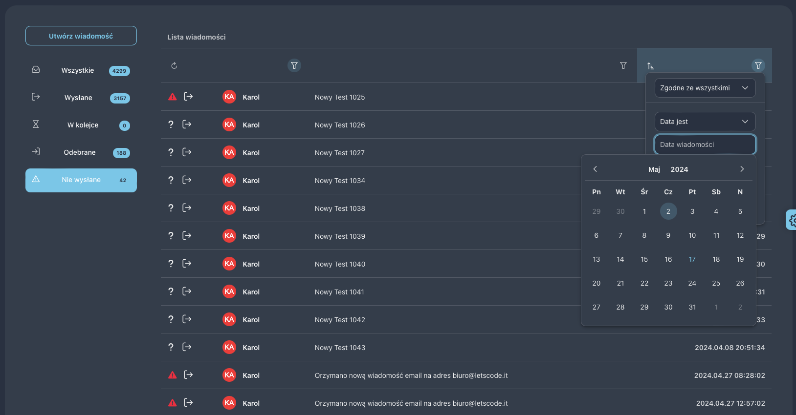

Package responsible for pagination and sorting of tables with primeVue on the Laravel + InertiaJs side.
======

---
Author: [Let's Code IT - Karol Sójka](https://www.letscode.it/) 



---

### Installation
Install the package
```php
composer require karlos3098/laravel-primevue-table-service
```

Publish components for vue
```sh
php artisan vendor:publish --provider="Karlos3098\\LaravelPrimevueTableService\\Providers\\LaravelPrimevueTableServiceProvider"
```

> [!WARNING]
> Now the most difficult step, but very important

For our package to work, we need to replace one file from primevue - DataTable.vue
This file is different for each version of Vue.
We have prepared files for you for the primevue version:
- 3.46.0

Then overwrite the import into the DataTable component in your app.js file using the appropriate version from the list
```js
import DataTable from '@/karlos3098/laravel-primevue-table-service/src/Assets/PrimeVue/3.46.0/DataTable.vue';
```

Now you just need to add these 2 main components to your app.js file as well
```js
import AdvanceTable from '@advance-table/Components/AdvanceTable.vue';
import AdvanceColumn from '@advance-table/Components/AdvanceColumn.vue';
```

Don't forget to initialize them!
```js
app
.component('AdvanceTable', AdvanceTable)
.component('AdvanceColumn', AdvanceColumn)
```


------
## It's time to create the first table.

We recommend using this approach of using services in Laravel. Your file could then look something like this:
```php
<?php

namespace App\Services;

use App\Http\Resources\MessageResource;
use App\Models\Message;
use Illuminate\Http\Resources\Json\AnonymousResourceCollection;
use Karlos3098\LaravelPrimevueTableService\Enum\TableCalendarDateFormat;
use Karlos3098\LaravelPrimevueTableService\Services\BaseService;
use Karlos3098\LaravelPrimevueTableService\Services\Columns\TableCalendarColumn;
use Karlos3098\LaravelPrimevueTableService\Services\Columns\TableTextColumn;
use Karlos3098\LaravelPrimevueTableService\Services\TableService;

final class MessageService extends BaseService
{
    public function __construct(
        protected Message $messageModel,
    ) {
    }

    /**
     * @throws \Exception
     */
    public function findAll(): AnonymousResourceCollection
    {
        return $this->fetchData(
            MessageResource::class,
            $this->messageModel,
            new TableService(
                globalFilterColumns: ['text'],
                columns: [
                    'text' => new TableTextColumn(
                        placeholder: 'Search by text'
                    ),
                    'contact' => new TableTextColumn(
                        placeholder: 'Message contact name',
                        queryPaths: [
                            'senderPhoneNumber.phone_number', 'senderContact.name',
                            'receivers.phoneNumber.phone_number', 'receivers.contact.name',
                        ],
                    ),
                    'date' => new TableCalendarColumn(
                        format: TableCalendarDateFormat::YMD,
                        placeholder: 'Search by created at',
                        sortable: true,
                        queryPaths: ['created_at'],
                        sortPath: 'created_at',
                    ),
                    'type' => new TableDropdownColumn(
                        placeholder: 'Select Message Type',
                        options: [
                            new TableDropdownOptionTag(
                                label: 'Incomming',
                                query: fn ($query) => $query->where('incomming', true),
                                severity: TagSeverity::SUCCESS
                            ),
                            new TableDropdownOptionTag(
                                label: 'Outgoing',
                                query: fn ($query) => $query->where('incomming', false),
                                severity: TagSeverity::INFO
                            ),
                        ]
                    ),
                ],
                rowsPerPage: [30, 100],
                propName: 'messages',
            )
        );
    }
}
```

Then the controller could be something like:
```php
<?php

namespace App\Http\Controllers;

use App\Http\Controllers\Controller;
use App\Services\MessageService;
use Illuminate\Http\Request;
use Inertia\Inertia;

class MessageController extends Controller
{
    public function __construct(
        protected MessageService $messageService,
    ) {
    }

    public function index()
    {
        return Inertia::render('Messages/Index', [
            'messages' => $this->messageService->findAll(),
        ]);
    }
}
```

------
### Now it's time to display the table in the frontend.

```vue

<script setup lang="ts">
    import { MessageResource } from './MessageResource';

    type Data = {
        data: MessageResource;
    };
</script>

<template>
    <MessagesTemplate>
        <AdvanceTable
            prop-name="messages"
        >
            <template #header="{ globalFilterValue, globalFilterUpdated }">
                <div class="flex justify-content-end">
                    <InputText
                        :value="globalFilterValue"
                        @update:model-value="globalFilterUpdated"
                        placeholder="Search"
                    />
                </div>
            </template>


            <AdvanceColumn field="contact" style="min-width: 4rem">
                <template #body="{ data }: Data">
                    <div class="flex align-items-center md:justify-content-start">
                        
                        <div class="flex flex-column mx-3">
                                <span class="block text-900 font-semibold">{{
                                data.first_receiver.phone_number.name
                            }}</span>
                        </div>
                    </div>
                </template>
            </AdvanceColumn>

            <AdvanceColumn field="text"></AdvanceColumn>

            <AdvanceColumn field="date" dataType="date">
                <template #body="{ data }: Data">
                    <div :style="{ minWidth: '10rem' }">
                        <div class="flex justify-content-end w-full px-0">
                            <span ref="dateRef" class="date-text text-700 font-semibold white-space-nowrap">
                                {{ data.created_at }}
                            </span>
                        </div>
                    </div>
                </template>
            </AdvanceColumn>

            <AdvanceColumn field="type"></AdvanceColumn>
            
        </AdvanceTable>
    </MessagesTemplate>
</template>

```

Let's start with 'globalFilterColumns'
This is a list of fields in which the global search engine should search above the table, placed in the header template.
---
In the above example, we display 3 columns in the table that we manage:
- contact
- text
- date

The simplest example is the text column.
This is a regular text column where we can simply search by phrase.

The second interesting one is 'contact'. The name is not used either in the resource or as a field in the model. This is a proper name for communication between vue and the backend.
'queryPaths' is important here.
Here we can provide a list of fields (as you can see, also from the relationship) on which filtering should take place.
If they were not provided, the website would automatically try to search in the 'contact' column, which does not exist.

Another example is the 'date' column.
In this case, I declared it as a 'created_at' column and filtering is to take place there, but here we also have sorting.

The last example is 'type' in which we can search by selecting an option from the list.

----
You will also find 'rowsPerPage' under the column declaration. It tells you about the available pagination's per page in the table.

Also remember to provide the correct 'propName', i.e. the prop under which you pass the table in inertiajs. In case of an incorrect name, there will be no reaction to sorting and pagination.

---
## Summary

The project was created with the intention of implementing it in several of my own projects, but I decided to share it.
I am willing to cooperate and expand it.
In the near future I also wanted to do some filtering using the numeric range that primevue provides, but I'm running out of time.

For the project to work, I had to replace one import in the DataTable.vue file with my file, but each version of DataTable is different.

Still, my solution that provides this will work from version 3.46 and a dozen or so versions upwards, but you would have to throw the rest of the versions into the project for convenience.
